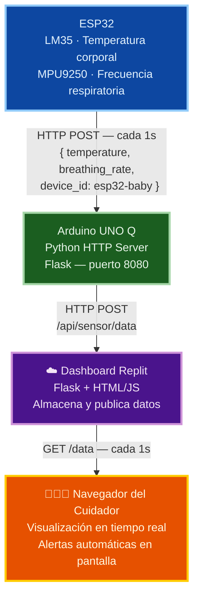
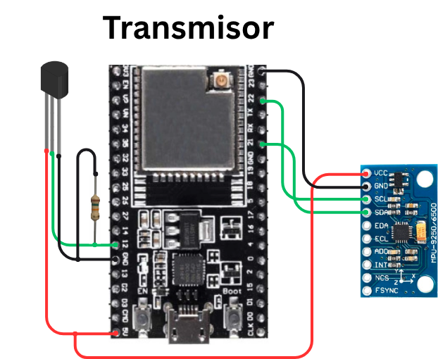

# PROY-2026-GRUPO6

Repositorio del grupo 6 para el proyecto del ramo *Proyecto Inicial (IWG400)* – 2026.

## 👥 Integrantes del grupo

| Nombre y Apellido | Usuario GitHub | Correo USM               | Rol USM      |
| ----------------- | -------------- | ------------------------ | ------------ |
| Miguel  Llancao   | @Miguelito160  | mllancao@usm.cl          | 202630029-3  |
| Alejandro Muñoz   | @FlrMoka       | amunoznav@usm.cl         | 202630013-7  |
| Camila Aburto     | @cxtrasca      | caburto@usm.cl           | 202630008-0  |

## 📝 Descripción breve del proyecto

> *Este proyecto es un sistema de monitoreo continuo para lactantes basado en un ESP32, que usa un sensor MPU9250 para calcular la frecuencia respiratoria y un sensor de temperatura LM35 para medir la temperatura corporal del bebé. Los datos sensados se envían vía WiFi a un servidor web alojado en Replit, donde se muestran en tiempo real en una página web y se generan alertas automáticas cuando la temperatura o la frecuencia respiratoria salen de los rangos normales para su edad.*

---

## 🎬 Video de Demostración
 https://youtu.be/bwz-503Oki4?feature=shared
 
## 🎯 Objetivos

**Objetivo general:**

* Facilitar la monitorización de signos vitales (temperatura corporal y frecuencia respiratoria) en lactantes, mediante un sistema electrónico de bajo costo que permita a los padres o cuidadores supervisar su estado de salud de forma remota y en tiempo real.

**Objetivos específicos:**

* Diseñar un sistema de adquisición de datos basado en ESP32 capaz de medir la temperatura corporal y la frecuencia respiratoria del lactante mediante sensores LM35 y MPU9250.

* Implementar un mecanismo de alerta visual/web que notifique de forma clara y sencilla cuando los valores medidos se encuentren fuera de los rangos normales considerados según la edad del lactante.

* Transmitir los datos sensados de forma inalámbrica a un servidor web, permitiendo su visualización en tiempo real desde cualquier dispositivo con acceso a internet.

* Brindar mayor tranquilidad a los padres durante el horario de sueño del bebé, al contar con un monitoreo continuo y automatizado que reduzca la necesidad de supervisión constante y manual.
---

## 🧩 Alcance del proyecto

Dentro del alcance:
* Medición de temperatura corporal y frecuencia respiratoria del lactante mediante sensores conectados al ESP32.
* Transmisión inalámbrica de los datos a un servidor web.
* Visualización en tiempo real de los datos en una página web.
* Alertas automáticas cuando los valores salen de los rangos normales según la edad.

Fuera del alcance (limitaciones):
* No reemplaza la supervisión médica ni constituye un diagnóstico clínico.
* No mide otros signos vitales (oxigenación, ritmo cardíaco, etc.).
* No incluye notificaciones móviles, ni alarmas físicas solo alertas en la página web.
* No ha sido validado clínicamente en lactantes reales; es un prototipo.

---

## 🛠️ Tecnologías y herramientas utilizadas

### Lenguajes de Programación
- **C/C++** — Firmware del ESP32 (Arduino IDE)
- **Python** — Servidor HTTP en el Arduino UNO Q (Arduino App Lab)
- **HTML / CSS / JavaScript** — Interfaz web del dashboard (embebida en Flask)
### Microcontroladores
 
| Dispositivo | Rol |
|---|---|
| **ESP32 (modelo U)** | Lectura de sensores LM35 y MPU9250, envío de datos vía WiFi |
| **Arduino UNO Q** | Servidor HTTP intermedio; recibe del ESP32 y reenvía a Replit |
 
### Sensores
 
| Sensor | Magnitud medida | Conexión |
|---|---|---|
| **MPU9250** | Aceleración eje Y → frecuencia respiratoria (RPM) | I2C (pines 21/22 del ESP32) |
| **LM35** | Temperatura corporal (°C) | Analógico (pin 34 del ESP32) |
 
### Software y Plataformas
 
| Herramienta | Uso |
|---|---|
| Arduino App Lab | IDE y entorno de ejecución del Arduino UNO Q |
| Arduino IDE | Programación y carga del firmware al ESP32 |
| Replit | Dashboard web en la nube (visualización + alertas) |
| GitHub | Control de versiones y entrega del proyecto |
 
### Librerías principales
 
| Librería | Plataforma | Uso |
|---|---|---|
| `MPU9250_asukiaaa` | ESP32 | Lectura del acelerómetro MPU9250 |
| `WiFi.h` + `HTTPClient.h` | ESP32 | Conexión WiFi y envío HTTP |
| `Arduino_RouterBridge` | Arduino UNO Q | Comunicación Python ↔ sketch |
| `flask` + `requests` | Arduino UNO Q (Python) | Servidor HTTP y reenvío a Replit |

---

## 🗂️ Estructura del Repositorio
 
```
PROY-2026-GRUPO6/
│
├── src/                              # Código fuente del proyecto
│   ├── esp32/
│   │   └── esp32_baby_monitor.ino   # Firmware del ESP32 (sensores + WiFi)
│   ├── arduino_1q/
│   │   ├── sketch.ino               # Sketch del Arduino UNO Q
│   │   └── arduino_server.py        # Servidor HTTP Python (App Lab)
│   └── dashboard/
│       ├── main.py                  # Dashboard Flask en Replit
│       └── requirements.txt         # Dependencias Python del dashboard
│
├── docs/
│   └── Carta_Gantt_Grupo6.pdf       # Cronograma de trabajo
│
├── assets/
│   └── Transmisor.png               # Diagrama de conexiones del hardware
│
├── .gitignore
└── README.md
```
 
---
 
## 🚀 Instrucciones de Instalación y Uso
 
### Requisitos previos
- Arduino IDE 2.x o superior
- Arduino App Lab (aplicación de escritorio)
- Cuenta en [Replit](https://replit.com) para el dashboard web
- Red WiFi disponible
### 1. Clonar el repositorio
 
```bash
git clone https://github.com/FlrMoka/PLANTILLA-PROY-2026-Grupo6.git
cd PLANTILLA-PROY-2026-Grupo6
```
 
### 2. Configurar y subir el firmware del ESP32
 
1. Abrir `src/esp32/esp32_baby_monitor.ino` en el **Arduino IDE**.
2. Instalar las librerías necesarias desde **Herramientas → Administrar Bibliotecas**:
   - `MPU9250_asukiaaa` (buscar por nombre exacto)
   - `WiFi.h` y `HTTPClient.h` (incluidas con el core ESP32)
3. Si no tienes el core ESP32, agregarlo en **Archivo → Preferencias → URLs adicionales**:
```
   https://raw.githubusercontent.com/espressif/arduino-esp32/gh-pages/package_esp32_index.json
```
4. Editar las credenciales en el código:
```cpp
   const char* ssid     = "NOMBRE_DE_TU_RED_WIFI";
   const char* password = "CONTRASEÑA_WIFI";
   const char* serverName = "http://IP_ARDUINO_1Q:8080/data";
```
5. Seleccionar la placa **ESP32 Dev Module** y el puerto correcto.
6. Hacer clic en **Upload**.
7. Verificar en el **Monitor Serial (115200 baudios)** que el ESP32 se conecta y envía datos correctamente.
### 3. Ejecutar el servidor en el Arduino UNO Q
 
1. Abrir **Arduino App Lab** y cargar el proyecto desde `src/arduino_1q/`.
2. Presionar **Run** para compilar y desplegar el sketch.
3. En la terminal integrada (`>_`), iniciar el servidor Python:
```bash
pip install flask requests
kill $(lsof -t -i:8080) 2>/dev/null
nohup python3 /home/arduino/ArduinoApps/proyecto/arduino_1q/arduino_server.py > /tmp/server.log 2>&1 &
```
 
4. Editar `DASHBOARD_API_URL` en `arduino_server.py` con la URL real de tu proyecto Replit antes de ejecutar.
5. Verificar que el servidor esté activo:
```bash
ss -tlnp | grep 8080
```
 
### 4. Desplegar el dashboard en Replit
 
1. Crear un proyecto en [Replit](https://replit.com) de tipo **Python**.
2. Subir los archivos `src/dashboard/main.py` y `src/dashboard/requirements.txt`.
3. Hacer clic en **Run** — Replit instalará las dependencias automáticamente.
4. La URL pública del dashboard quedará disponible para acceder desde cualquier dispositivo.
🔗 Dashboard actual: [https://esp-web-host--miguelllancao20.replit.app](https://esp-web-host--miguelllancao20.replit.app)
 
---
---

## 📐 Diseño del Sistema





-Imagen ilustrativa de como se vería las conexiónes de nuestro proyecto.

### Rangos de alerta implementados
 
| Parámetro | Rango normal | Estado de alerta |
|---|---|---|
| Temperatura | 35.6 °C – 37.9 °C | `< 35.6 °C` → Hipotermia · `> 37.9 °C` → Fiebre |
| Frecuencia respiratoria | 30 – 60 RPM | `< 30 RPM` → Apnea · `> 60 RPM` → Taquipnea |
---

## 📅 Cronograma de trabajo

[Carta Gantt](https://usmcl-my.sharepoint.com/:x:/g/personal/cflorest_usm_cl/IQBMn-xOXonNRIqmBjaSvqLRAXTBRb4JK0oXyoDaD-OnSwc?e=4hwgP9)

---

## 📚 Bibliografía

- Frecuencia respiratoria (respiraciones por minuto) en lactantes:
American Academy of Pediatrics. (s.f.). Fever and your baby. HealthyChildren.org. https://www.healthychildren.org/English/health-issues/conditions/fever/Pages/Fever-and-Your-Baby.aspx

- Temperatura corporal en lactantes: 
World Health Organization. (1997). Thermal protection of the newborn: A practical guide. WHO. https://www.who.int/publications/i/item/WHO-RHT-MSM-97-2

- Documentación Arduino UNO Q — Arduino App Lab:
https://docs.arduino.cc/arduino-app-lab/

- MPU9250 Library (asukiaaa): 
https://github.com/asukiaaa/MPU9250_asukiaaa
- LM35 Datasheet — Texas Instruments: 
https://www.ti.com/product/LM35
---

## 📌 Notas adicionales

Conseguir sensores térmicos y hacerlos funcionar con Arduino.

* El servidor Python del Arduino UNO Q debe iniciarse manualmente desde la terminal de App Lab con el comando indicado en el paso 3.
* El dashboard de Replit es público y muestra los últimos valores recibidos con actualización automática cada 1 segundo.
* Verificar la calibración del sensor LM35 con un termómetro de referencia antes de la presentación final.
* Confirmar el valor real de las resistencias del divisor de voltaje para ajustar correctamente el offset de temperatura.
* Pendiente probar el sistema con mediciones reales en condiciones controladas (no solo en laboratorio).
* Revisar estabilidad de la conexión WiFi y el servidor Replit, ya que puede haber tiempos de inactividad (sleep) en el plan gratuito.
* Considerar agregar un sensor adicional (ej. SpO2) como posible mejora futura, fuera del alcance actual.
* Pendiente acordar con el grupo quién se encarga de la documentación final y quién de las pruebas de hardware.
* El sistema detecta automáticamente la ausencia de movimiento (7 segundos sin señal → RPM = 0) para evitar lecturas falsas en reposo.
